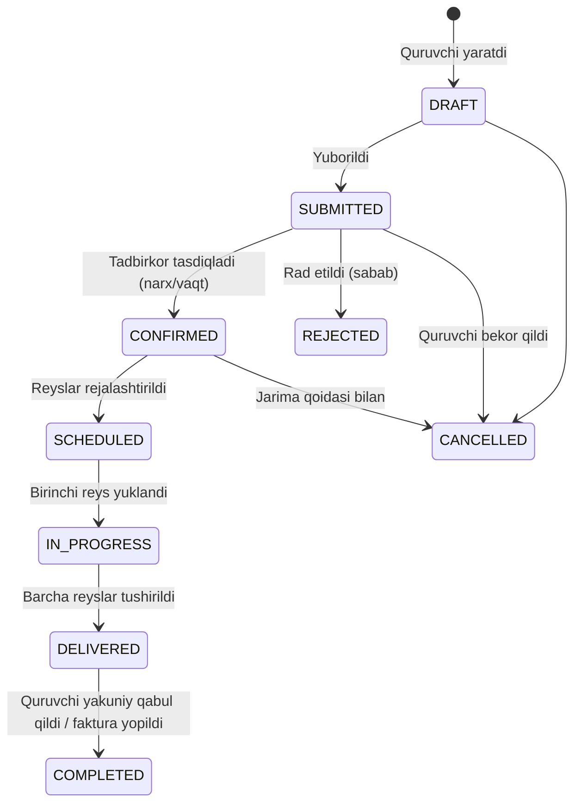
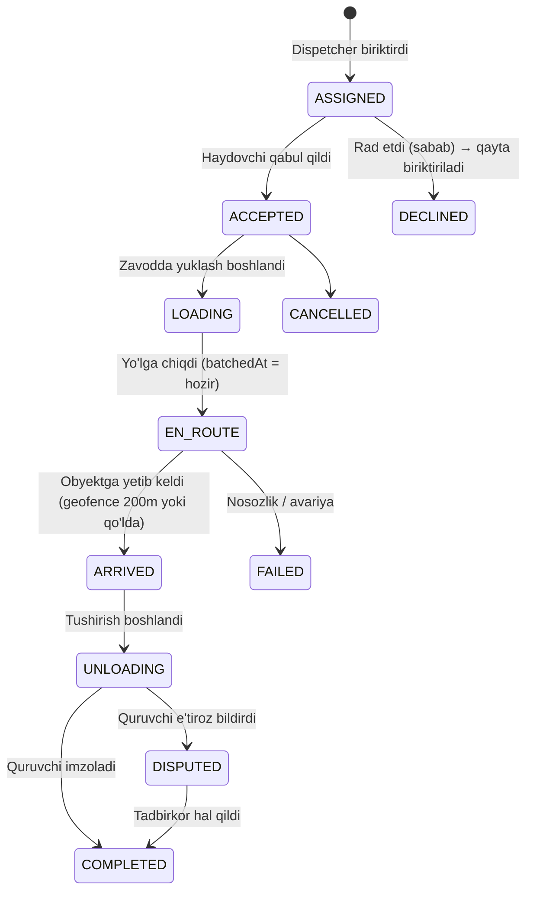

# 01 · Biznes arxitekturasi — Insof ECO

> Beton zavodi va Qishloq qurilishi uchun yagona raqamli platforma.
> Uch rol: **Tadbirkor**, **Quruvchi**, **Haydovchi**. Bitta mobil ilova (iOS + Android), rolga qarab interfeys o'zgaradi.

---

## 1. Muammo va maqsad

Bugungi holat (odatiy beton zavodi):

| Bosqich | Hozir qanday | Muammo |
|---|---|---|
| Buyurtma | Telefon qo'ng'irog'i, Telegram | Yo'qoladi, hajm/marka noto'g'ri yoziladi |
| Dispetcherlik | Qog'oz jurnal, og'zaki | Mashina qaysi obyektda ekani noma'lum |
| Yetkazish | Haydovchi o'zi biladi | Beton 90 daqiqadan oshib ketsa yaroqsiz — nazorat yo'q |
| Qabul qilish | Qog'oz nakladnoy, imzo | Nizolar: "kam keldi", "sifatsiz" |
| Hisob-kitob | Excel, daftar | Qarzdorlik ko'rinmaydi, kassa uzilishlari |

**Maqsad:** buyurtmadan pulgacha bo'lgan butun zanjirni (order-to-cash) bitta tizimga olib kirish, har bir rolga faqat o'ziga kerakli oynani berish.

### Muvaffaqiyat ko'rsatkichlari (KPI)

- Buyurtma qabul qilish vaqti: 10 daqiqa → 1 daqiqa
- "Yo'qolgan" buyurtmalar: 0
- Har bir reys uchun yuklash→tushirish vaqti nazoratda (≤ 90 daq)
- Mashinalar band bo'lish darajasi (utilization) +20%
- Qarzdorlik ko'rinishi: real vaqtda

---

## 2. Rollar va ularning "ish kuni"

### 2.1 Tadbirkor (biznes egasi / direktor / dispetcher)

Kim: zavod egasi yoki qurilish kompaniyasi rahbari. Ko'pincha 1–3 kishi.

Ertalab ochganda ko'rishi kerak:
- Bugungi buyurtmalar (hajm m³, marka bo'yicha), tasdiqlash kutayotganlar
- Mashinalar holati: bo'sh / yuklanmoqda / yo'lda / tushirilmoqda
- Kecha ishlab chiqarilgan hajm, bugungi reja
- Qarzdorlar ro'yxati va kassa

Vazifalari:
- Buyurtmalarni tasdiqlash / rad etish / narx belgilash
- Reyslarni haydovchi va mashinaga biriktirish (dispatch)
- Katalog: beton markalari (M100…M400), narxlar, qo'shimcha xizmatlar (nasos, qo'shimcha km)
- Xodimlar: haydovchi qo'shish, ruxsat berish
- Moliya: hisob-fakturalar, to'lovlar (Payme/Click/naqd), qarz limitlari
- Hisobotlar: kunlik/oylik ishlab chiqarish, mashina samaradorligi, mijozlar bo'yicha

### 2.2 Quruvchi (prorab / pudratchi / xususiy quruvchi)

Kim: obyektda turgan odam. Telefoni doim qo'lida, internet o'zgaruvchan.

Vazifalari:
- **Buyurtma berish:** marka, hajm, obyekt manzili (xaritadan), sana va vaqt oynasi, nasos kerakmi, qatnov oralig'i (mashinalar orasidagi interval)
- **Kuzatish:** mashina qayerda, necha daqiqada keladi
- **Qabul qilish:** har reysni imzolash (raqamli), hajm/sifat bo'yicha izoh, foto
- **Obyekt boshqaruvi (Qishloq qurilishi):** obyektlar ro'yxati, bosqichlar (poydevor → devor → tom), kunlik hisobot, material so'rovi
- **Moliya:** joriy qarz, to'lov qilish (Payme/Click), hisob-faktura yuklab olish

### 2.3 Haydovchi (mikser haydovchisi)

Kim: kun bo'yi rulda. Ilova bilan minimal ishlashi kerak — katta tugmalar, 1–2 ta harakat.

Vazifalari:
- Bugungi reyslar ro'yxati, navbatdagi reysni qabul qilish
- Holatni bitta tugma bilan o'zgartirish: **Yuklandim → Yo'lga chiqdim → Yetib keldim → Tushirdim**
- Fonda GPS uzatish (faqat reys davomida)
- Nakladnoy foto, quruvchi imzosi, muammo xabar berish (nosozlik, yo'l yopiq)
- Quruvchiga qo'ng'iroq (bir tugma), xarita navigatsiyasi (Yandex/Google Maps ga o'tish)

---

## 3. Domen modeli (DDD — bounded contexts)

```mermaid
flowchart LR
  subgraph Identity["Identity & Access"]
    U[User] --> M[Membership: rol + tashkilot]
    O[Organization: PLANT | CONTRACTOR]
  end
  subgraph Catalog
    MIX[ConcreteMix: M200, M300…]
    PL[PriceList]
    SVC[ExtraService: nasos, km]
  end
  subgraph Orders
    ORD[Order] --> OI[OrderItem]
    ORD --> SITE[ConstructionSite]
  end
  subgraph Logistics
    V[Vehicle: mikser 7–10 m³]
    D[DriverProfile]
    TRIP[Delivery / Reys] --> EV[DeliveryEvent]
    TRIP --> GPS[GpsPoint]
  end
  subgraph Production
    BATCH[Batch ticket]
  end
  subgraph Construction["Qishloq qurilishi"]
    SITE --> STG[Stage]
    STG --> RPT[DailyReport]
    STG --> MR[MaterialRequest]
  end
  subgraph Billing
    INV[Invoice] --> PAY[Payment]
    CR[CreditLimit]
  end
  ORD -->|1..n| TRIP
  TRIP --> BATCH
  ORD --> INV
  MR -->|beton bo'lsa| ORD
```

**Tashkilot turlari:**
- `PLANT` — beton zavodi (Tadbirkor egasi, Haydovchilar xodimi)
- `CONTRACTOR` — qurilish tashkiloti / xususiy quruvchi (Quruvchi a'zosi; Tadbirkor bo'lishi ham mumkin — qurilish kompaniyasi egasi)

Bitta foydalanuvchi bir nechta tashkilotda turli rolda bo'lishi mumkin (Membership). Bu "Tadbirkor ham quruvchi" holatini yechadi.

---

## 4. Asosiy jarayonlar (state machines)

### 4.1 Buyurtma (Order)



Biznes qoidalari:
- `SUBMITTED` → `CONFIRMED` faqat **Tadbirkor** (PLANT tashkilotidagi). Tasdiqlashda narx muzlatiladi (price snapshot) — keyin narx o'zgarsa buyurtmaga ta'sir qilmaydi.
- Hajm → reyslar: `ceil(hajm / mashina_sig'imi)`; oxirgi reys to'liq bo'lmasligi mumkin. Dispetcher qo'lda o'zgartira oladi.
- Buyurtma yetkazish vaqtidan **24 soat oldin** bekor qilinsa jarimasiz; undan keyin — tashkilot sozlamasidagi foiz.
- Kredit limiti: `qarz + yangi buyurtma summasi > limit` bo'lsa, `SUBMITTED` da ogohlantirish, Tadbirkor tasdiqlashi shart (yoki oldindan to'lov).

### 4.2 Reys (Delivery)



Biznes qoidalari (beton texnologiyasi):
- **90 daqiqa qoidasi:** `EN_ROUTE` dan `UNLOADING` gacha 90 daqiqadan oshsa — reys `SLA_BREACH` bayrog'i oladi, Tadbirkor va Quruvchiga push. (Sozlanadi: yozda 60 daq.)
- GPS faqat `ACCEPTED…UNLOADING` oralig'ida yig'iladi (batareya va shaxsiy hayot).
- `ARRIVED` avtomatik: mashina obyektdan 200 m radiusga kirsa (server tomonda geofence), lekin haydovchi qo'lda ham bosa oladi.
- `COMPLETED` uchun Quruvchi imzosi (ekranga chizilgan) yoki OTP-kod (agar quruvchi ilovasiz bo'lsa — SMS orqali 4 xonali kod, haydovchi kiritadi).
- Bir haydovchida bir vaqtda faqat **bitta** faol reys.

### 4.3 Qurilish obyekti (Qishloq qurilishi)

`ConstructionSite` → `Stage[]` (poydevor, devor, tom, pardoz) → har bosqichda `DailyReport` (foto, bajarilgan ish, ishchilar soni) va `MaterialRequest` (beton bo'lsa → avtomatik `Order DRAFT` yaratiladi; boshqa materiallar → ro'yxat, keyinchalik yetkazib beruvchilar moduli).

### 4.4 Hisob-kitob

- Har `COMPLETED` reys → `InvoiceLine`. Buyurtma `DELIVERED` bo'lganda `Invoice` yakunlanadi.
- To'lov: naqd (Tadbirkor qo'lda belgilaydi), Payme, Click (webhook orqali tasdiqlanadi). Har to'lov `Payment` yozuvi; qarz = Σ invoices − Σ payments.
- Oy oxirida akt-sverka PDF (Quruvchi yuklab oladi).

---

## 5. Ruxsatlar matritsasi (RBAC + egalik)

| Amal | Tadbirkor (PLANT) | Tadbirkor (CONTRACTOR) | Quruvchi | Haydovchi |
|---|:-:|:-:|:-:|:-:|
| Buyurtma yaratish | ✓ (mijoz nomidan) | ✓ | ✓ | – |
| Buyurtmani tasdiqlash / narx | ✓ | – | – | – |
| Reys biriktirish | ✓ | – | – | – |
| Reys holatini o'zgartirish | ✓ (override) | – | – | ✓ (faqat o'ziniki) |
| Reysni qabul qilish (imzo) | – | ✓ | ✓ (faqat o'z buyurtmasi) | – |
| Katalog / narxlar | ✓ | – | ko'rish | – |
| Mashina / haydovchi boshqaruvi | ✓ | – | – | – |
| Moliya (barcha mijozlar) | ✓ | – | – | – |
| Moliya (o'z tashkiloti) | ✓ | ✓ | ✓ | – |
| Obyektlar / bosqichlar | ✓ (o'z tashk.) | ✓ | ✓ | – |
| GPS ko'rish | ✓ (barcha) | o'z buyurtmasi | o'z buyurtmasi | – |

Qoida: har so'rov ikki bosqichda tekshiriladi — (1) rol ruxsati, (2) resurs egaligi (`organizationId` mos kelishi). Backendda `PolicyGuard` shu ikkalasini birga qiladi.

---

## 6. Monetizatsiya va o'sish

1-bosqich: bitta zavod (Insof ECO) — ichki vosita.
2-bosqich: **SaaS** — boshqa zavodlar o'z tashkilotini ochadi (tenant = Organization). Arxitektura boshidanoq ko'p-tenantli (har jadvalda `organizationId`).
3-bosqich: marketplace — quruvchi bir nechta zavoddan narx so'raydi.

Shu sababli: hech qayerda "bitta zavod" deb hardcode qilinmaydi.

---

## 7. Tashqi integratsiyalar (O'zbekiston konteksti)

| Ehtiyoj | Provayder | Izoh |
|---|---|---|
| SMS OTP | Eskiz.uz (yoki Play Mobile) | Telefon raqam bilan kirish — parol yo'q |
| To'lov | Payme, Click | Webhook + idempotency |
| Xarita | Google Maps (iOS/Android), Yandex (navigatsiya uchun deep-link) | Qishloqda Yandex aniqroq |
| Push | Expo Push → FCM (Samsung) / APNs (Apple) | |
| Fayl | S3-compatible (MinIO → keyin Yandex Object Storage / AWS) | Foto, imzo, PDF |
| Soliq | Keyinchalik: didox / faktura.uz (elektron hisob-faktura) | Interfeys tayyorlab qo'yiladi |

---

## 8. Xavflar va qarorlar

| Xavf | Yechim |
|---|---|
| Haydovchi telefonida internet yo'q | Offline navbat: holat o'zgarishlari lokal saqlanadi, ulanganda yuboriladi (idempotent event ID bilan) |
| Batareya (fon GPS) | Faqat faol reysda, 15 s / 50 m interval, harakat bo'lmasa to'xtatiladi |
| Quruvchi ilovani o'rnatmaydi | SMS-OTP bilan qabul qilish; web-link orqali kuzatish (keyingi bosqich) |
| Nizolar ("kam keldi") | Har reysda foto + imzo + GPS izi + vaqt tamg'alari — dalil bazasi |
| Rollar aralashib ketishi | Membership modeli, bitta akkaunt → bir nechta tashkilot/rol, rol tanlash ekrani |
