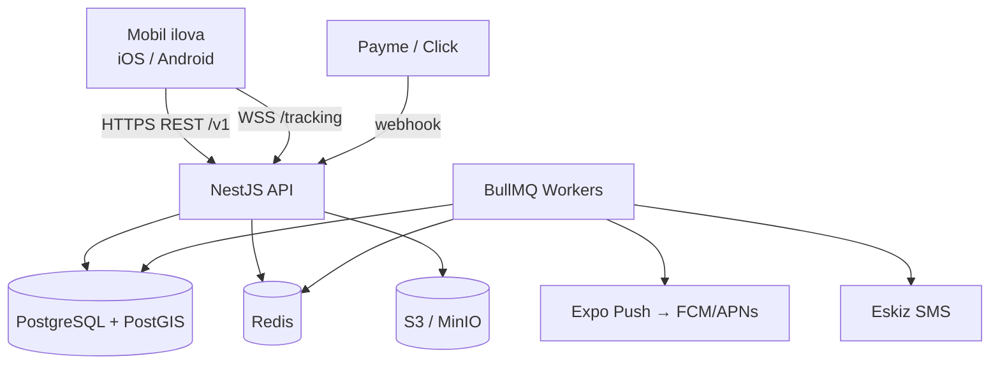

# 02 · Backend arxitekturasi

## 1. Umumiy ko'rinish

**Uslub:** Modulli monolit (modular monolith). Mikroservis emas — jamoa kichik, domen bitta, tranzaksiyalar (buyurtma → reys → faktura) bir bazada bo'lgani qulay. Modullar orasidagi chegara qat'iy (har modul faqat o'z `service` orqali, boshqa modul jadvaliga to'g'ridan-to'g'ri yozmaydi), shuning uchun kelajakda kerak bo'lsa modulni alohida servisga ajratish oson.

**Stack:**

| Qatlam | Tanlov | Sabab |
|---|---|---|
| Runtime | Node.js 22 LTS, TypeScript | Mobil bilan bir til, `packages/shared` orqali umumiy tiplar |
| Framework | NestJS 10 | Modullar, DI, guard/interceptor, OpenAPI — jamoaviy ish uchun standart |
| DB | PostgreSQL 16 + PostGIS | Tranzaksiyalar, geofence (`ST_DWithin`), JSONB |
| ORM | Prisma | Tip-xavfsiz, migratsiyalar; murakkab geo so'rovlar uchun `$queryRaw` |
| Cache / queue / pub-sub | Redis 7 + BullMQ | OTP, rate-limit, fon ishlari (SLA tekshiruvi, push), WebSocket adapter |
| Realtime | Socket.IO gateway (`/tracking`) | Haydovchi GPS → Quruvchi/Tadbirkor xaritasi |
| Fayl | S3 API (MinIO lokal) | Presigned URL — fayl backend orqali o'tmaydi |
| Auth | Telefon + OTP → JWT (access 15 daq) + refresh (30 kun, rotatsiya) | Parolsiz, O'zbekiston odati |
| Observability | pino (JSON log), OpenTelemetry, `/health` | |
| Test | Jest (unit), Supertest + Testcontainers (e2e) | |



## 2. Modullar

```
apps/api/src
├── main.ts                 bootstrap, helmet, versioning, swagger
├── app.module.ts
├── common/                 cross-cutting: guards, decorators, filters, pipes
│   ├── auth/               JwtAuthGuard, CurrentUser, Roles, PolicyGuard
│   ├── errors/             DomainError → HTTP mapping
│   └── idempotency/        Idempotency-Key interceptor (mobil offline navbat uchun)
├── infra/
│   ├── prisma/             PrismaService
│   ├── redis/
│   ├── storage/            S3 presigned URLs
│   ├── sms/                SmsPort + EskizAdapter + FakeAdapter
│   └── push/               PushPort + ExpoAdapter
└── modules/
    ├── auth/               OTP so'rash, tasdiqlash, refresh, logout
    ├── users/              profil, qurilmalar (push token)
    ├── organizations/      tashkilot, a'zolik, taklif (invite)
    ├── catalog/            beton markalari, narxlar, qo'shimcha xizmatlar
    ├── sites/              qurilish obyektlari, bosqichlar, kunlik hisobot
    ├── orders/             buyurtma + state machine + narx snapshot
    ├── dispatch/           reyslarni rejalashtirish, biriktirish
    ├── deliveries/         reys state machine, imzo, foto, nizo
    ├── tracking/           WS gateway, GPS ingest, geofence
    ├── billing/            faktura, to'lov, Payme/Click webhook, qarz
    ├── notifications/      push + SMS + in-app, shablonlar
    └── reports/            agregatlar (kunlik ishlab chiqarish, utilization)
```

Har modul ichida: `*.controller.ts` (HTTP), `*.service.ts` (biznes), `*.repository.ts` (Prisma, ixtiyoriy), `dto/` (zod → `packages/shared` dan), `events/` (domen hodisalari).

**Modullar aro aloqa:** Nest `EventEmitter2` orqali domen hodisalari (`order.confirmed`, `delivery.completed`). Masalan `billing` moduli `delivery.completed` ni tinglab `InvoiceLine` yaratadi — `deliveries` moduli `billing` haqida bilmaydi.

## 3. Ma'lumotlar modeli (asosiy jadvallar)

To'liq sxema: `apps/api/prisma/schema.prisma`. Asosiy qoidalar:

- Har biznes jadvalda `organizationId` (tenant) va `createdAt/updatedAt`. ID — `cuid`.
- Pul — `Decimal(14,2)` (so'm), hajm — `Decimal(8,2)` (m³). Float ishlatilmaydi.
- Holatlar — Postgres `enum`. O'tishlar faqat servisdagi jadval orqali (`ORDER_TRANSITIONS`).
- Buyurtmada narx **snapshot** (`unitPriceSnapshot`) — katalog o'zgarsa tarix buzilmaydi.
- `DeliveryEvent` — append-only audit (kim, qachon, qaysi holatga, GPS, foto). Reys holati — oxirgi event.
- `GpsPoint` — bo'linadigan (partition by month) jadval; 90 kundan keyin arxiv.
- Yumshoq o'chirish (`deletedAt`) faqat katalog va tashkilotlarda; buyurtma/reys hech qachon o'chirilmaydi.

## 4. API dizayni

- `/v1/...` — URL versiyalash. Breaking change → `/v2`, eski versiya 6 oy.
- Javob konverti: muvaffaqiyat — to'g'ridan-to'g'ri obyekt; xato — `{ code, message, details? }`, `code` mashina o'qiydigan (`ORDER_INVALID_TRANSITION`). Mobil `code` bo'yicha tarjima qiladi.
- Ro'yxatlar: cursor-pagination (`?cursor=&limit=`), `updatedAt` bo'yicha delta-sync (`?since=`) — mobil offline kesh uchun.
- Yozuvchi so'rovlarda `Idempotency-Key` header (UUID, mobil generatsiya qiladi). Bir xil kalit 24 soat ichida → o'sha javob. Haydovchi internetsiz bosgan "Yetib keldim" ikki marta kelmaydi.
- Validatsiya: zod sxemalar `packages/shared` da — backend `ZodValidationPipe`, mobil forma o'sha sxemani ishlatadi. **Bitta manba.**
- OpenAPI: `/docs` (faqat non-prod).

Asosiy endpointlar:

```
POST   /v1/auth/otp/request        { phone }                → { retryAfter }
POST   /v1/auth/otp/verify         { phone, code, device }  → { access, refresh, user, memberships }
POST   /v1/auth/refresh
POST   /v1/auth/logout

GET    /v1/me                       profil + a'zoliklar
PUT    /v1/me/devices               push token

GET    /v1/catalog/mixes            (tenant bo'yicha)
PUT    /v1/catalog/mixes/:id        [Tadbirkor]

POST   /v1/orders                   [Quruvchi|Tadbirkor]
GET    /v1/orders?status=&since=
GET    /v1/orders/:id
POST   /v1/orders/:id/submit
POST   /v1/orders/:id/confirm       [Tadbirkor] { priceOverrides?, scheduledAt }
POST   /v1/orders/:id/reject        [Tadbirkor] { reason }
POST   /v1/orders/:id/cancel

POST   /v1/dispatch/orders/:id/plan [Tadbirkor] → reyslar avtomatik bo'linadi
POST   /v1/dispatch/deliveries/:id/assign { driverId, vehicleId }

GET    /v1/deliveries/mine?date=    [Haydovchi]
POST   /v1/deliveries/:id/transition { to, at, location?, photoKey?, note? }
POST   /v1/deliveries/:id/sign      [Quruvchi] { signatureKey | otpCode }
POST   /v1/deliveries/:id/dispute   [Quruvchi] { reason, photoKeys }

WS     /tracking   client→ 'gps' {deliveryId, lat, lng, speed, at}
                   server→ 'position' {deliveryId, lat, lng, etaMin}

GET    /v1/billing/summary          qarz, oxirgi to'lovlar
POST   /v1/billing/payments/payme   webhook (Payme protokoli)
POST   /v1/billing/payments/click   webhook

POST   /v1/files/presign            { contentType, purpose } → { url, key }
```

## 5. Xavfsizlik

- OTP: 6 xonali, 2 daqiqa, bitta raqamga 3 ta/soat, IP bo'yicha 10/soat (Redis). Kod hash bilan saqlanadi (argon2).
- JWT: RS256 (kalitlar env orqali), `sub`, `sid` (session id), `org`, `role`. Refresh — bir martalik, rotatsiya, oilaviy bekor qilish (reuse aniqlansa butun sessiya oilasi o'chadi).
- Har so'rovda `X-Org-Id` header → faol tashkilot; `PolicyGuard` a'zolikni tekshiradi.
- Webhook: Payme — Basic auth + merchant kalit; Click — `sign_string` md5 tekshiruvi; ikkalasi ham idempotent (`transactionId` unique).
- PII: telefon raqam indekslanadi, lekin loglarga chiqmaydi (pino redact).
- Rate limit: `@nestjs/throttler`, Redis storage.
- Helmet, CORS faqat mobil (Expo) va admin domen uchun.

## 6. Fon ishlari (BullMQ)

| Queue | Ish | Trigger |
|---|---|---|
| `sla` | 90-daqiqa tekshiruvi | `delivery.en_route` da delayed job (t+90m) |
| `notify` | push / SMS yuborish | domen hodisalari |
| `geofence` | `ARRIVED` avtomatik | har GPS nuqtada (throttle 30 s) |
| `reports` | kunlik agregatlar | cron 00:10 |
| `gps-archive` | eski nuqtalarni siqish | cron haftalik |

## 7. Deploy

- **Dev:** `docker compose` (Postgres+PostGIS, Redis, MinIO), `yarn dev:api`.
- **Prod (1-bosqich):** bitta VPS (4 vCPU/8 GB, O'zbekiston DC — ping muhim), Docker Compose, Caddy (auto-TLS), Postgres managed yoki o'sha serverda + kunlik `pg_dump` → S3.
- **Prod (2-bosqich, SaaS):** k8s yoki Nomad, API 2+ replika, Redis adapter WS uchun, read-replica hisobotlar uchun.
- CI: GitHub Actions — lint, typecheck, unit, e2e (Testcontainers), docker build, migratsiya `prisma migrate deploy` deploy oldidan.
- Migratsiyalar orqaga qaytariladigan bo'lishi shart (expand → migrate → contract).

## 8. Kuzatuv

- Har so'rovda `requestId` (mobil ham yuboradi) — loglarni bog'lash.
- Metrikalar: so'rov latensiyasi (p95), queue backlog, faol WS ulanishlar, SLA buzilishlar soni.
- Alert: 5xx > 1% / 5 daq; queue backlog > 1000; DB ulanish > 80%.
